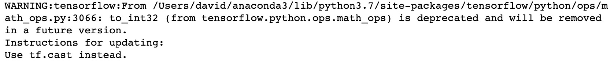

# David's Personal Blog

> 我是如何使用Tensorflow来实现我的第一个项目的


## 使用Tensorflow实现多层感知机


首先，你要有tensorflow库

```python
!pip install tensorflow
```

> 这一过程需要等待⌛️一段时间，当然，如果你网络够快。

### 导入包
> 没有包的同学可以到这里拿

```git
git clone https://github.com/EncodingDavid/tensorflow.git
```

```python
from tensorflow.examples.tutorials.mnist import input_data
import tensorflow as tf
```
### 使用MNIST数据集
> 这是一个经典的数据集，经典程度不用多说，新手入门搞Tensorflow几乎都逃不开它。

```python
mnist = input_data.read_data_sets("MNIST_data/",one_hot=True)
```
### 定义噪音
> 定义噪音是为了防止数据过拟合

```python
sess = tf.InteractiveSession()
```

### 设置Variable并初始化

> 因为使用的激活函数是`ReLu`，所以需要使用正态分布给参数加一点噪声，来打破完全对称并且避免0梯度。

```python
in_units = 784
h1_units = 300
W1 = tf.Variable(tf.truncated_normal([in_units,h1_units],stddev = 0.1))
b1 = tf.Variable(tf.zeros([h1_units]))
W2 = tf.Variable(tf.zeros([h1_units,10]))
b2 = tf.Variable(tf.zeros([10]))
```
### 定义输入x的placeholder

> 因为在训练和预测，Dropout的比率`keep_prob`是不一样的，通常在训练是小于1，而在预测时等于1，所以也把Dropout的比率作为计算图的输入，并定义成一个placeholder

```python
x = tf.placeholder(tf.float32,[None,in_units])
keep_prob = tf.placeholder(tf.float32)
```
### 定义模型结构

> 首先需要一个隐层，命名为hidden1，可以通过`tf.nn.relu(tf.matmul(x,W_1)+b_1)`实现一个激活函数为ReLU的隐层，计算公式为**y=relu(W_1x+b_1)**这里的`keep_prob`参数即为保留数据而不设置为0的比例，在训练时应该是小于1的，用以制造随机性，防止过拟合；在预测时应该等于1，即使用全部特征来预测样本的类别。最后是输出层，也就是第3章介绍的Softmax，这一行代码的功能和之前的是一致的。

```python

hidden1 = tf.nn.relu(tf.matmul(x,W1)+b1)
hidden1_drop = tf.nn.dropout(hidden1, keep_prob)
y = tf.nn.softmax(tf.matmul(hidden1_drop,W2)+b2)

```
### 定义损失函数和选择优化器来优化loss

```python
y_ = tf.placeholder(tf.float32, [None, 10])
cross_entropy = tf.reduce_mean(-tf.reduce_sum(y_ * tf.log(y),reduction_indices = [1]))
train_step = tf.train.AdagradOptimizer(0.3).minimize(cross_entropy)
```


> 如果输出结果如上图所示，则说明这一步成功>.<

### 训练步骤

> - 加入了keep_prob作为计算图的输入
- 在训练时设置0.75，其余25%为0，一般来说，对越复杂越大规模的神经网络，Dropout的效果更显著
- 因为加入了隐层，我们需要更多的训练迭代来优化模型以达到一个比较好的效果
- 所以一共采用来3000个batch，每个batch包含100条样本，一共30万样本

```python
tf.global_variables_initializer().run()
for i in range(3000):
    batch_xs, batch_ys = mnist.train.next_batch(100)
    train_step.run({x: batch_xs, y_: batch_ys, keep_prob: 0.75})
```

### 对模型进行准确评估
> 直接令keep_prob=1，可以达到较好的预测效果

```python
correct_prediction = tf.equal(tf.argmax(y,1),tf.argmax(y_,1))
accuracy = tf.reduce_mean(tf.cast(correct_prediction, tf.float32))
print(accuracy.eval({x: mnist.test.images,y_: mnist.test.labels,keep_prob: 1.0}))
```
> 我的结果是0.97，你呢
### 总结

相比之前的Softmax，误差由8%下降到2%，准确率可以说是飞跃性提升。而这个提升仅仅是加入了一个隐层实现，可见多层神经网络的效果有多显著。 当然，我们也加入了Dropout,Adagrad,ReLU等，但决定性的还是隐层，它能对特征进行抽象和转化。

新加入了一个隐层，并使用了Dropout、Adagrad和ReLU，而代码没有增加很多，非常简洁。

不过，使用全连接神经网络也是有局限性的，即使我们使用很深的网络，很多的隐藏节点，很大的迭代次数，也很难在MNIST数据集上获得99%以上的准确率，这要用到卷积神经网络